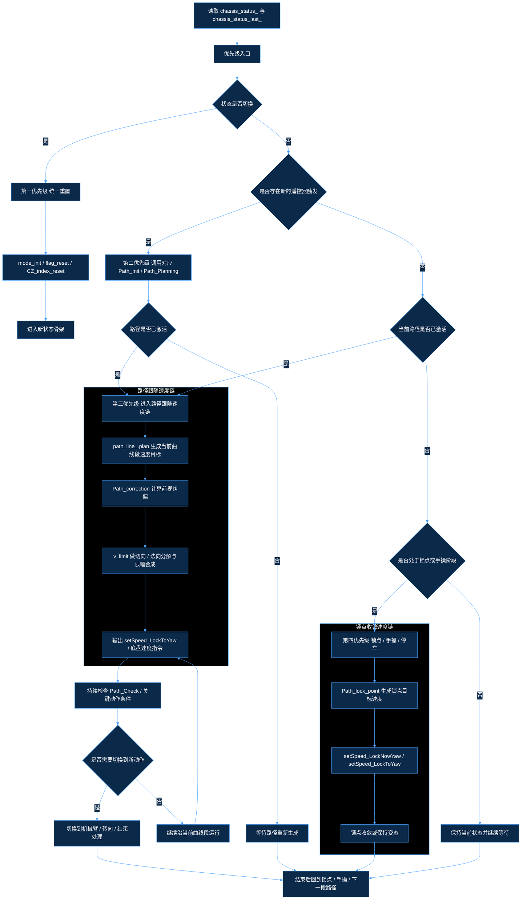
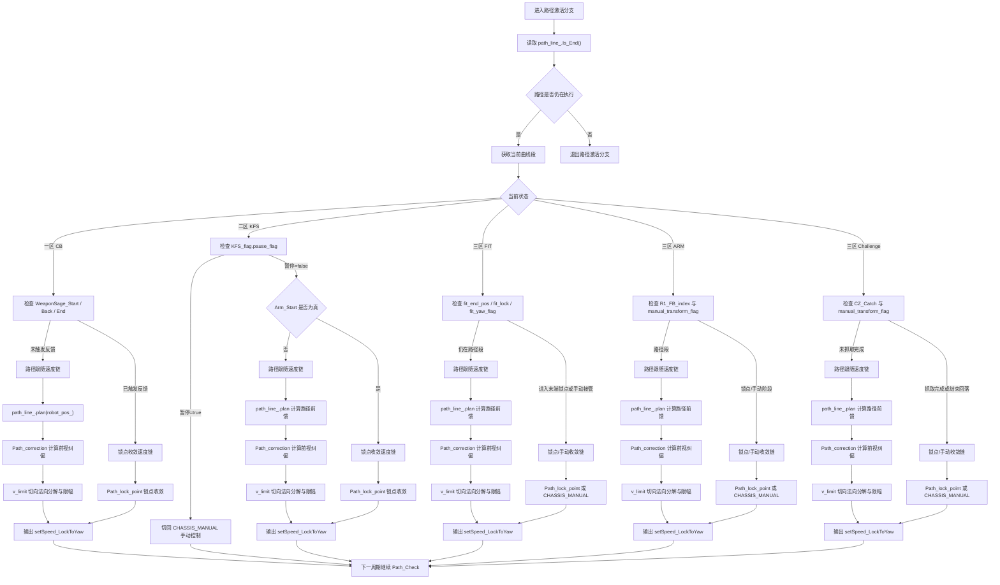
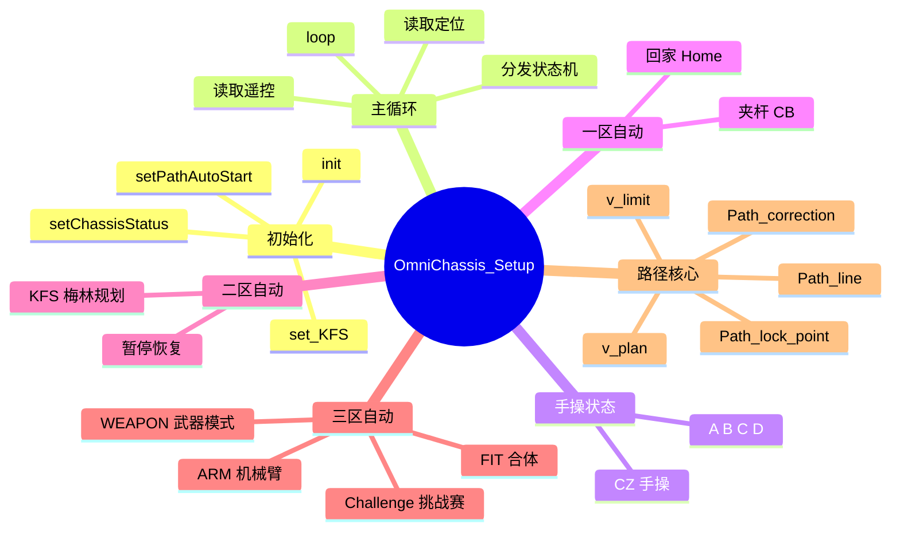

# 舵轮底盘控制代码思维导图

整体上，这套底盘控制可概括为一条统一执行链：
状态进入 -> `mode_init()` 统一重置 -> 对应状态的 `*_Path_Init()` 构建路径 -> `*_Path_Check()` 或状态内条件判断推进执行 -> `v_plan()`/`Path_lock_point()` 生成速度输出 -> 路径结束后转入手动、锁点或停车分支。

其中最关键的规划函数是 `KFS_Selection_Planning()`，它负责将“目标点编号 + 当前位姿 + 阵营方向 + 是否上坡”转换为完整可执行路径，是二区自动逻辑的核心调度函数。

## 0. 统一状态框架

这张总图强调执行优先级：先判断状态切换，再判断遥控器触发，然后判断路径是否已激活，最后才进入锁点或手操分支。

### 0.1 所有状态的共用骨架

- 首先读取当前 `chassis_status_`，并与 `chassis_status_last_` 比较。
- 当两者不一致时，先执行统一重置流程，以避免上一状态的路径、标志位、锁点和机械臂状态残留到新状态。
- 统一重置的核心动作包括 `mode_init()`、`flag_reset()`、`CZ_index_reset()`、`path_line_.Reset()`、`path_line_.plan_reset()`，以及将 `Path_end_point` 重新对齐到当前 `robot_pos_`。
- 仅当状态未变化，或者状态重置完成后，才进入遥控器触发判断，检查是否存在遥控边沿、按键或状态切换信号。
- 文中的“遥控器触发”分为三类：边沿触发、持续状态触发和方向判定触发。
- 边沿触发包括 `flag == 1`、`airjoy_data_.RT == 1`、`d_pad_up == 1`、`d_pad_down == 1` 等瞬时信号。
- 持续状态触发包括 `airjoy_data_.SWC`、`airjoy_data_.SWE` 以及摇杆偏移量是否超过阈值。
- 方向判定触发包括 `right_x`、`left_x`、`left_y` 的正负方向，用于判定远近位、左右位和手动前后映射。
- 当存在遥控器触发时，进入对应状态的路径生成函数，例如 `CB_Selection_Planning()`、`KFS_Selection_Planning()`、`CZ_FIT_Path_Init()`、`CZ_ARM_Path_Init()`。
- 当不存在新的遥控器触发但当前路径已激活时，底盘继续执行路径规划，速度由 `path_line_.plan()`、`Path_correction()`、`v_limit()` 或 `Path_lock_point()` 合成。
- 当不存在新的遥控器触发且当前路径已激活时，状态保持不变，但路径速度规划和关键动作检查继续执行。
- 当不存在新的遥控器触发且当前路径未激活时，检查是否已进入路径结束、锁点保持或手操接管阶段；若尚未进入这些阶段，则维持当前状态并等待下一次遥控器触发。
- “保持当前状态并继续检查”表示状态机不切换，但当前状态的执行逻辑仍然运行：路径激活时继续规划，路径未激活时等待触发。
- 当状态刚发生切换时，即使没有新的遥控器触发，也必须先执行统一重置，再进入新的状态骨架，不能直接沿用上一状态的路径计算。
- 当路径已经生成且仍处于激活状态时，底盘速度不再直接来自摇杆映射，而是依次由 `path_line_.plan()` 生成前馈速度、由 `Path_correction()` 计算纠偏速度、再由 `v_limit()` 或锁点逻辑合成为最终输出。
- 路径执行过程中会持续进行状态检查；一旦发现机械臂到位、到达关键点、需要转向或需要暂停，就切换到对应分支。
- 路径结束后统一回到锁点、手动或零电流状态，不再继续沿旧路径输出。

### 0.2 所有状态的差异点

- 一区的差异点在于 `CB_Selection_Planning()` 生成夹杆、回退、相机或回家路径。
- 二区的差异点在于 `KFS_Selection_Planning()` 需要把多个 MF 点、转向点、拐角点和上坡点串接为一条连续路径。
- 三区的差异点在于 `CZ_*_Path_Init()` 需要同时处理机械臂状态、远近位切换、合体流程与挑战赛上坡路径。
- 手操状态的差异点仅在输入映射和目标航向锁定方式。

### 0.3 路径已生成时的速度来源

- 先由 `path_line_.plan(robot_pos_)` 计算当前路径段的规划速度，得到切向前馈速度 `V.planspeed`。
- 再由 `Path_correction()` 计算当前位置到前视点的纠偏速度 `V.corrVelocity`。
- 当处于普通路径段时，`v_limit()` 将纠偏速度分解为切向和法向分量，并在限幅后与前馈速度合成为最终速度。
- 当处于 KFS 过弯锁定状态或挑战赛特殊曲线状态时，会提高纠偏权重，以提高轨迹贴合度。
- 当进入终点锁点阶段时，速度由 `Path_lock_point()` 生成；该函数以终点误差为输入，通过位置 PID 生成锁点速度。
- 当进入纯手操阶段时，速度直接由 `CHASSIS_MANUAL()` 对摇杆的映射生成，不再依赖路径规划。

### 0.4 路径中的持续检查机制

- 路径不是一次生成后固定不变，而是在每个循环中持续检查 `curve.Get_End_point()`、`path_line_.Is_End()`、`pid_dead_flag`、机械臂反馈标志和当前输入状态。
- 一旦检测到新的触发条件，就会从路径跟随切换到锁点、机械臂动作、目标航向调整或暂停恢复。
- 因此，路径跟踪是“主循环执行 + 实时条件判定”的模式，而不是单次线性流程。
- 统一框架必须同时描述“路径生成”和“路径执行中的状态再判定”。

### 0.4.1 路径激活后的详细状态流程图

### 0.4.2 这一段代码的运行顺序

- 第一步判断 `path_line_.Is_End() == false`，即路径仍处于执行状态。
- 第二步通过 `curve = path_line_.get_bezier_curve()` 取出当前正在跟踪的曲线段。
- 第三步进入路径跟随速度链，内部依次经过 `path_line_.plan()`、`Path_correction()`、`v_limit()`。
- 第四步当当前状态触发机械臂、回退或末端收敛条件时，改走锁点收敛速度链，由 `Path_lock_point()` 直接输出速度。
- 第五步将计算得到的 `Chassis_Target.VX / VY` 和 `target_yaw` 一并传入 `setSpeed_LockToYaw()`。
- 第六步在下一周期再次回到 `Path_Check()`，继续判断关键点、机械臂和路径结束条件。

### 0.4.3 路径激活时底盘速度的来源

- `path_line_.plan(robot_pos_)` 负责生成路径前馈速度，其方向与当前曲线段切向一致。
- `Path_correction()` 负责生成纠偏速度，其数值由前视点与当前位置的误差经 PID 计算得到。
- `v_limit()` 负责将纠偏速度分解为切向和法向分量，并在限幅后与前馈速度合成为最终速度。
- `Path_lock_point()` 负责生成锁点收敛速度，其输入为终点或目标点误差，输出不再依赖曲线前馈。
- 在一区 CB 中，当夹杆、回退或结束反馈触发时，速度会从路径跟随速度链切换到锁点收敛速度链。
- 在二区 KFS 中，当 `Arm_Start == true` 时，速度会从路径跟随速度链切换到 `Path_lock_point(curve.Get_Start_point())`。
- 在三区 FIT / ARM / Challenge 中，速度会根据 `fit_lock`、`manual_transform_flag`、`CZ_Catch`、`yaw_lock` 等标志，在路径跟随速度链、锁点收敛速度链和 `CHASSIS_MANUAL()` 之间切换。

### 0.5 对比代码后需要特别注意的逻辑问题

- `Path_line::Is_End()` 的命名与实际语义容易混淆。代码中的返回值更接近“当前路径是否仍在执行”，而不是字面意义上的“是否结束”，因此在状态框架中不能直接按名称解释。
- `CHASSIS_AUTO_CONTROL_CB`、`CHASSIS_AUTO_CONTROL_KFS`、`SEMI_AUIO_CZ_FIT`、`SEMI_AUIO_CZ_ARM`、`SEMI_AUIO_CZ_ARM_Challenge` 都依赖 `path_line_.Is_End()` 决定“继续路径”还是“回落手操/锁点”；如果按字面含义理解，判断方向会写反，这是统一框架中最容易出错的点之一。
- `Path_correction()` 里 `pid_dead_flag = (pid_pos_y.get_is_in_dead_zone() && pid_pos_y.get_is_in_dead_zone())` 重复引用了同一个轴；按逻辑应当同时判断 X/Y 两个方向，这会直接影响后续锁点和死区判定。
- `rotation_path()` 在未命中任何已知地图点时没有显式返回值，这会使 `KFS_Selection_Planning()` 中的朝向计算存在未定义行为风险。
- 三区状态中部分分支将 `manual_transform_flag`、`fit_yaw_flag`、`dead_cnt`、`yaw_lock` 混合使用；如果不先区分当前处于路径段、锁点段还是手动段，就容易导致状态跳转顺序混乱。
- `SEMI_AUIO_CZ_FIT` 和 `SEMI_AUIO_CZ_ARM` 的路径结束后逻辑并非“结束即退出”，而是还需要继续执行锁点、姿态收口和手动接管判断，因此在统一框架中必须区分“路径结束”和“流程结束”。

### 0.6 统一框架的正确理解方式

- 第一层先看输入：是否存在自动启动、暂停、方向切换、放置或抓取触发。
- 第二层看状态：当前处于手操、一区、二区、三区还是停止，同时确认 `chassis_status_` 是否已经切换。
- 第三层看路径：若路径已经生成并处于激活状态，则继续执行速度规划；若路径尚未生成，则进入对应规划函数。
- 第四层看速度来源：路径段速度来自 `v_plan()`，锁点速度来自 `Path_lock_point()`，手操速度来自 `CHASSIS_MANUAL()`。
- 第五层看中途插入条件：机械臂触发、转向条件、暂停条件、上坡条件都会中断纯路径跟随。
- 第六层看结束回落：路径结束后回到锁点、手操或零电流状态，而不是继续沿旧路径运行。

### 0.7 状态切换优先级图

- 这一部分已经合并进上面的统一状态框架图，优先级判定不再单独重复绘制。
- 对应关系仍然保持不变：状态切换重置 > 遥控器触发 > 路径激活 > 锁点/手操 > 持续检查与动态切换。

### 0.8 优先级说明

- 最高优先级是状态切换重置，也就是 `chassis_status_` 和 `chassis_status_last_` 不同时，必须先复位再干别的。
- 第二优先级是新的遥控器触发，触发后才决定是否进入新的路径生成函数。
- 第三优先级是路径是否已激活，已激活就继续路径速度规划，即使没有新的遥控器触发也不能停。
- 第四优先级是锁点或手操阶段，只有在路径未激活时才退回到这一步。
- 第五优先级是持续检查和动态切换，任何机械臂、转向、暂停、结束条件都可以在路径执行过程中插入。

### 0.9 这一顺序和代码的对应关系

- `mode_init()` 体现的是第一优先级的状态切换重置。
- `CB_Path_Init()`、`KFS_Path_Init()`、`CZ_FIT_Path_Init()`、`CZ_ARM_Path_Init()` 体现的是第二优先级的遥控器触发驱动。
- `path_line_.Is_End() == false` 的路径分支体现的是第三优先级的路径持续激活。
- `Path_lock_point()` 和 `CHASSIS_MANUAL()` 体现的是第四优先级的锁点与手操回落。
- `CB_Path_Check()`、`KFS_Path_Check()` 以及三区状态中的附加判断体现的是第五优先级的持续检查和动态切换。

### 1. 遥控器触发总表

- `flag == 1`：自动流程起始边沿，由 `setPathAutoStart()` 写入，第一次进入自动流程时触发路径生成。
- `airjoy_data_.RT == 1`：遥控器暂停/恢复边沿，区分了一区回家、二区暂停、以及三区合体等待等流程中的切换行为。
- `airjoy_data_.SWC == 0x00`：遥控器开关处于 0 档，表示一区夹杆主流程，决定路径最终走向 `CB_End_pos`。
- `airjoy_data_.SWC == 0x01`：遥控器开关处于 1 档，表示一区贴边/相机支路，决定路径最终走向 `CB_transition_pos` 和 `CB_welt_pos`。
- `airjoy_data_.SWE == 0`：遥控器开关处于 0 档，三区武器模式进入手动档，底盘按摇杆直接运动。
- `airjoy_data_.SWE == 1`：遥控器开关处于 1 档，三区武器模式进入锁角态，底盘保持目标航向。
- `airjoy_data_.d_pad_up == 1`：遥控器上键触发，表示“放置物块”或“进入合体等待路径”。
- `airjoy_data_.d_pad_down == 1`：遥控器下键触发，表示“退回准备”或“进入等待/抓取路径”。
- `airjoy_data_.d_pad_left == 1` / `airjoy_data_.d_pad_right == 1`：遥控器左右键触发，根据红蓝方阵营决定远近位切换，触发 `R1_RL_index` 或 `R2_pos_index` 的变化。
- `airjoy_data_.right_x`：遥控器右摇杆横向量，用于左右方向连续判定，超过阈值后触发远近位切换或手动转向节奏判断。
- `airjoy_data_.left_x`、`airjoy_data_.left_y`：遥控器左摇杆横纵量，用于纯手操或者路径结束后的微调控制，决定底盘平移分量。

### 1.1 各状态对应的遥控器触发逻辑

- 一区 CB：`flag` 触发开始，`RT` 触发暂停/回家，`SWC` 选择夹杆或贴边/相机支路。
- 二区 KFS：`flag` 触发开始，`RT` 触发暂停或恢复，`KFS1 / KFS2 / KFS3` 决定是否有有效任务，路径执行过程中还会根据机械臂反馈触发锁点或继续规划。
- 三区 FIT：`d_pad_up` 触发进入合体等待，`d_pad_down` 触发等待锁定，左右方向键切换 R2 位点。
- 三区 ARM：`d_pad_up` 和 `d_pad_down` 分别触发放置与退回，`right_x` 左右拨动触发 R1 远近位切换。
- 三区 WEAPON：`SWE` 决定手动与锁角两种模式，不依赖路径规划。
- 三区 Challenge：`flag` 触发上坡挑战路径，`d_pad_up` / `d_pad_down` / `right_x` 共同决定抓取、放置和位点切换。
- 手操状态：不依赖路径触发，依靠遥控器摇杆直接生成速度，属于持续输入型控制。

## 总览

## 1. 通用入口

### 1.1 `init()`

- 检查四个轮子对象是否为空。
- 打开三轮解算 `setThreeWheelSolver(true)`。
- 初始化位置 PID、锁点 PID。
- 启动 RTOS 任务。
- 最后置 `init_flag = true`。

### 1.2 `loop()`

- 如果未初始化，直接返回。
- 更新 Lora 遥控数据到 `airjoy_data_`。
- 读取定位模块当前世界坐标与航向。
- 读取红蓝方阵营标志 `RB_Flag`。
- 把机器人位置写入 `robot_pos_`。
- 按 `chassis_status_` 进入不同状态分支。

### 1.3 状态切换辅助

- `setChassisStatus()` 负责切换总状态。
- `setPathAutoStart()` 负责写入自动起始边沿触发位 `flag`。
- `flag_reset()` 负责清空自动流程阶段标志。
- `mode_init()` 负责检测状态切换后的统一重置。

## 2. 手操状态框架

### 2.1 `CHASSIS_MANUAL_CONTROL_A`

- 目的：大速度平移加角速度控制。
- 调用 `CHASSIS_MANUAL(1.6f, 1.6f, 3.0f)`。
- 输出使用 `setSpeed_LockNowYaw()`。
- 用于快速机动。

### 2.2 `CHASSIS_MANUAL_CONTROL_B`

- 目的：低速平移，锁当前航向。
- 调用 `CHASSIS_MANUAL(0.6f, 0.6f)`。
- 输出使用 `setSpeed_LockNowYaw()`。
- 用于精细修位。

### 2.3 `CHASSIS_MANUAL_CONTROL_C`

- 目的：常规全向速度控制，锁当前航向。
- 调用 `CHASSIS_MANUAL(1.0f, 1.0f)`。
- 输出使用 `setSpeed_LockNowYaw()`。
- 用于常规驾驶。

### 2.4 `CHASSIS_MANUAL_CONTROL_D`

- 目的：平移控制并锁定固定航向 0°。
- 调用 `CHASSIS_MANUAL(0.8f, 0.8f)`。
- 输出使用 `setSpeed_LockToYaw(..., 0.0f)`。
- 用于需要固定朝向的手动场景。

### 2.5 `CHASSIS_MANUAL_CONTROL_CZ`

- 目的：三区手动模式。
- 调用 `CHASSIS_MANUAL(1.0f, 1.0f, 2.0f, true)`。
- 输出使用 `setSpeed_LockNowYaw()`。
- 用于三区中的人工接管。

### 2.6 手操共性入口 `CHASSIS_MANUAL()`

- 读取左摇杆和右摇杆。
- 根据机器人所在区域切换前后映射。
- 根据 `RB_Flag` 做红蓝场方向翻转。
- 当 `yaw_update` 为真时，同步 `target_yaw = yaw`。
- 统一生成 `Chassis_Target.VX / VY / yaw_rate`。

## 3. 一区自动状态框架

### 3.1 `CHASSIS_AUTO_CONTROL_CB`

- 入口先调用 `mode_init()`。
- 再调用 `CB_Path_Init()` 和 `CB_Path_Check()`。
- 路径未结束时：
  - 取 `curve = path_line_.get_bezier_curve()`。
  - 若未进入机械臂反馈阶段，调用 `v_plan()`。
  - 否则调用 `Path_lock_point(curve.Get_Start_point())`。
  - 最后使用 `setSpeed_LockToYaw()`。
- 路径结束后：
  - 允许左摇杆做微调手动控制。
  - `target_yaw = yaw`。
  - 使用 `setSpeed_LockNowYaw()`。

### 3.2 `CB_Path_Init()`

- 监听自动起始位 `flag`。
- 第一次进入时清标志并调用 `CB_Selection_Planning()`。
- 监听 `airjoy_data_.RT` 作为暂停触发。
- 暂停时清标志并切到 `CB_Home_Selection_Planning()`。

### 3.3 `CB_Selection_Planning()`

- 检查是否处于合法地图区域。
- 将 `target_yaw` 置 0°。
- 重置路径规划器。
- 若启用 `CB_SINGLE`，则轮换夹杆点位。
- 路径组成：
  - 起点 `Add_Start_Point()`。
  - 必要时加入夹杆起始过渡点 `CB_Start_pos`。
  - 加入夹杆目标点 `CB_Selection_pos`。
  - 加入回退点 `{CB_Selection_pos.x, back_y}`。
  - 根据 `SWC` 选择相机流程终点或贴边流程终点。
- 最终写入 `Path_end_point`。

### 3.4 `CB_Home_Selection_Planning()`

- 检查是否处于合法地图区域。
- 清空路径规划器。
- 起点为当前位置。
- 若位置满足条件，插入回家中转点 `home_transition_pos`。
- 终点设置为 `home_pos`。
- 写入 `Path_end_point`。

### 3.5 `CB_Path_Check()`

- 用静态标志判断是否到达夹杆点、回退点、退后段结束点。
- 到达夹杆点后置 `WeaponSage_Start = true`。
- 到达回退点后置 `WeaponSage_Back = true`。
- 当 `SWC == 0x00` 时：
  - 路径未结束时，如果已退到旋转区域，设置 `target_yaw` 为 ±90°。
  - 路径结束后置 `WeaponSage_End = true`。
- 当 `SWC == 0x01` 时：
  - 处理贴边与相机流程的结束判断。
  - 达到目标距离后调用 `path_line_.plan_reset()` 并置结束标志。
- 若终点是 `home_pos`，则 `target_yaw = 0°`。

## 4. 二区自动状态框架

### 4.1 `CHASSIS_AUTO_CONTROL_KFS`

- 入口先调用 `mode_init()`。
- 再调用 `KFS_Path_Init()`。
- 若未暂停：
  - 路径未结束时，调用 `KFS_Path_Check()`。
  - 未触发机械臂时执行 `v_plan()`。
  - 已触发机械臂时执行 `Path_lock_point(curve.Get_Start_point())`。
  - 输出用 `setSpeed_LockToYaw()`。
- 路径结束后进入手动驾驶模式。
- 若暂停，则直接切到手动控制。

### 4.2 `KFS_Path_Init()`

- 第一次进入时把 `KFS_point.MF1 / MF2 / MF3` 转存到 `KFS1 / KFS2 / KFS3`。
- 清标志并调用 `KFS_Selection_Planning()`。
- `RT` 边沿触发用于暂停/恢复。
- 暂停后会压缩已完成的 KFS 目标点序列。
- 恢复时会把 `Path_end_point` 重新置为当前位置并重新规划。

### 4.3 `KFS_Selection_Planning()`

- 检查地图合法性，只允许在一区和二区启动。
- 根据 `KFS1 / KFS2 / KFS3` 判断本次规划是 1 点、2 点还是 3 点任务。
- 调用 `MF_AutoCtrler::PathInformation_calc()` 获取关键路径信息。
- 计算每个 MF 点的地图编号与朝向。
- 将 MF 点映射到世界坐标。
- 判断是否需要中途转向：
  - `spin_flag`
  - `spin_flag_0`
  - `spin_flag_2`
- 生成整条贝塞尔路径并写入 `Path_end_point`。

### 4.3.1 `KFS_Selection_Planning()` 的输入

- 输入 1：机器人当前世界坐标 `robot_pos_`。
- 输入 2：阵营方向 `RB_Flag`。
- 输入 3：目标编号 `KFS1 / KFS2 / KFS3`。
- 输入 4：当前是否处于梅林地图范围。
- 输入 5：是否启用上坡进入三区 `KFS_flag.uphill_flag`。

### 4.3.2 第一步：合法性筛选

- 先判断是否允许启动规划。
- 仅在一区或二区且坐标范围合法时才继续。
- 如果目标编号组合非法，直接返回 `false`。
- 这一步的作用是避免错误状态下生成错误路径。

### 4.3.3 第二步：把目标数量归一化

- 根据 `KFS1 / KFS2 / KFS3` 的有效性，得到本次任务是 1 点、2 点还是 3 点流程。
- 这个 `KFS_num` 后续会决定：
  - 需要几个 MF 目标点。
  - 是否要计算第二次、第三次转向。
  - 路径末尾是否允许直接结束或需要上坡。

### 4.3.4 第三步：计算关键路径信息

- 用 `MF_AutoCtrler::PathInformation_calc()` 根据当前位置和目标编号计算整条逻辑路径。
- 得到 `Index_MFroad`，也就是每个 MF 点在路径中的索引位置。
- 再通过 `mustPastMap` 拿到整条路径必须经过的地图点序列。
- 这一步是整个函数的“路线规划引擎”。

### 4.3.5 第四步：把地图编号转成可执行动作

- 用 `KFS_keyPoint_.Index_MFroad` 反推出 MF1、MF2、MF3 在路径中的位置。
- 通过 `rotation_path()` 计算每个 MF 点的目标航向。
- 再将地图中心点 `MapCenterWorld_Vector2D()` 转成世界坐标。
- 如果物块高度和目标朝向需要偏移，还会修正 `MF1_pos_`。

### 4.3.6 第五步：判断是否需要中途转向

- 如果 MF1 到 MF2 的朝向不同，置 `KFS_flag.spin_flag = true`。
- 如果 MF2 到 MF3 的朝向不同，置 `KFS_flag.spin_flag_2 = true`。
- 若起点附近就需要转向，置 `KFS_flag.spin_flag_0 = true`。
- 这些标志会影响后续路径中是否插入 `spinodal_path()`。

### 4.3.7 第六步：生成起点到 MF1 的路径

- 先 `path_line_.Reset()` 和 `path_line_.plan_reset()`。
- 添加起点 `Add_Start_Point(robot_pos_, kfs_dead)`。
- 如果当前就在梅林地图内，先判断起始点是否已经靠近第一个必经点。
- 如果起点附近就要转向，会先插入拐角偏移段。
- 如果 MF1 是第一个停靠点，会插入 `MF1_pos_` 作为终点吸附点。

### 4.3.8 第七步：生成 MF1 到 MF2 的中间路径

- 遍历 `mustPastMap` 中间段的每一个地图点。
- 普通点直接用 `Add_Point(temp_vector, path_param.start)`。
- 拐角点会走 `spinodal_path()`，插入“前偏移点 + 曲线过渡点 + 后偏移点”。
- 如果遇到 MF1 停靠点，会加入 `MF1_pos_` 并标记已结束一个动作阶段。

### 4.3.9 第八步：生成 MF2 到终点的路径

- 从 `MF2_Index_` 开始继续遍历路径。
- 普通点继续添加直线或过渡点。
- 如果遇到 MF2 或 MF3 停靠点，则加入终点吸附点。
- 如果启用上坡模式，则在路径尾部自动插入上坡相关点位。

### 4.3.10 第九步：上坡衔接到三区

- 若 `KFS_flag.uphill_flag == true`，梅林路径结束后不会直接停止。
- 而是继续拼接：
  - `CZ_point.uphill_pos`
  - `CZ_point.uphill_transitiont_pos`
  - `CZ_point.R1_pos[1]`
- 这样二区结束后可以直接进入三区。

### 4.3.11 `spinodal_path()` 的作用

- 它不是普通加点，而是专门处理拐角顺滑过渡的函数。
- 先在拐角前插入一个偏移点。
- 再根据前进方向决定 `targetPos`。
- 再根据 `spin_flag` 调整中间转向偏移。
- 最后加入拐角后的偏移点。
- 这一段是 KFS 路径里最容易出问题的“拐弯平滑器”。

### 4.3.12 `KFS_Selection_Planning()` 的输出

- 输出 1：完整路径 `path_line_`。
- 输出 2：末端点 `Path_end_point`。
- 输出 3：每个 MF 点的世界坐标与朝向。
- 输出 4：中途转向标志 `spin_flag / spin_flag_0 / spin_flag_2`。
- 输出 5：是否需要上坡进入三区。

### 4.3.13 这一函数的本质

- 它把“离散地图点编号”转成“连续可执行底盘轨迹”。
- 它同时解决三类问题：
  - 目标顺序怎么排。
  - 转向在哪些点发生。
  - 路径末尾是否要衔接上坡和三区。
- 所以它不是单纯的路径生成函数，而是二区的总调度器。

### 4.4 `KFS_Path_Check()`

- 监控 MF1、MF2、MF3 是否已到达。
- 到点后触发 `Arm_Start = true`。
- 判断是否需要中途转向并更新 `target_yaw`。
- 若启用上坡模式：
  - 在上坡过渡位置后修正朝向。
  - 让路径最后自动衔接到三区。

### 4.5 `Path_correction()`

- 用贝塞尔曲线计算最近点和前视点。
- 若接近终点，退化为终点吸附。
- 使用位置 PID 计算 X/Y 纠偏速度。
- 输出 `V.corrVelocity`。

### 4.6 `v_plan()` 与 `v_limit()`

- `v_plan()` 先拿到路径规划速度 `V.planspeed`。
- 再叠加纠偏速度并做限幅。
- 若当前曲线处于过弯锁定状态，则提高纠偏权重。
- `v_limit()` 将速度分解为切向和法向分量。
- 切向受前馈和纠偏共同影响，法向做最大速度限制。

## 5. 三区自动状态框架

### 5.1 `CHASSIS_MANUAL_CONTROL_CZ`

- 三区纯手动接管模式。
- 直接调用 `CHASSIS_MANUAL()`。
- 输出使用 `setSpeed_LockNowYaw()`。

### 5.2 `SEMI_AUIO_CZ_FIT`

- 入口先调用 `mode_init()`。
- 再调用 `CZ_FIT_Path_Init()`。
- 用静态 `yaw_lock / yaw_tra` 辅助处理目标航向切换。
- 路径未结束时：
  - 调用 `v_plan()`。
  - 使用 `setSpeed_LockToYaw()`。
- 路径结束后：
  - 若已到合体终点或启用锁定，先看手动接管是否发生。
  - 若需要锁点，则调用 `Path_lock_point(Path_end_point)`。
  - 长时间死区稳定后进入 `kXPark`。

### 5.3 `CZ_FIT_Path_Init()`

- 上键：进入合体等待路径 `CZ_FIT_WAIT_Selection_Planning()`。
- 下键：进入等待锁定状态，设置 `fit_lock = true`。
- 左右方向键：切换远近位 R2 点位。
- 通过 `R2_pos_index` 决定当前要去的放置位置。

### 5.4 `CZ_FIT_WAIT_Selection_Planning()`

- 检查地图合法性。
- 起点为当前位置。
- 若当前航向与目标航向偏差较大，先绕到合体过渡点。
- 终点为 `fit_end_pos`。

### 5.5 `CZ_FIT_R2_Selection_Planning()`

- 检查地图合法性。
- 若当前航向已接近 ±90°，直接锁定目标航向。
- 否则设置 `CZ_flag.fit_yaw_flag = true`。
- 终点为 `R2_pos[R2_pos_index]`。

### 5.6 `SEMI_AUIO_CZ_ARM`

- 入口先调用 `mode_init()`。
- 再调用 `CZ_ARM_Path_Init()`。
- 路径未结束时：
  - `v_plan()`。
  - `setSpeed_LockToYaw()`。
- 路径结束后：
  - 如果还没进入手动变换，则先做 `chassis_manual_transform()`。
  - 再用 `Path_lock_point(Path_end_point)` 锁住末端。
  - 若已经进入手动变换，则切回手动模式。
  - 若 `CZ_Arm == false` 且在前后位索引上，需要重新规划 R1 路径。

### 5.7 `CZ_ARM_Path_Init()`

- 上键：放置物块，置 `R1_FB_index = 1`。
- 下键：退回准备，置 `R1_FB_index = 0`。
- 右摇杆左拨：蓝场远、红场近，切换 `R1_RL_index`。
- 右摇杆右拨：蓝场近、红场远，切换 `R1_RL_index`。
- 每次切换后调用 `CZ_R1_Selection_Planning()`。

### 5.8 `CZ_R1_Selection_Planning()`

- 检查是否处于三区合法区域。
- 设置目标航向为红场 180° / 蓝场 0°。
- 重置路径规划器。
- 若 `R1_FB_index == 1`：
  - 表示机械臂动作位。
  - 终点加偏移 `set_skew`。
- 否则直接去 R1 固定位。
- 写入 `Path_end_point`。

### 5.9 `SEMI_AUIO_CZ_WEAPON`

- 入口先调用 `mode_init()`。
- `SWE == 0`：手动驾驶。
- `SWE == 1`：锁定航向驾驶。
- 用于武器相关的纯控制模式。

### 5.10 `SEMI_AUIO_CZ_ARM_Challenge`

- 入口先调用 `mode_init()`。
- 再调用 `CZ_ARM_Challenge_Path_Init()`。
- 监控是否到达 `catch_pos`，到达后置 `CZ_Catch = true`。
- 若到达挑战赛中的 R1 关键点，则更新 `target_yaw = 180° / 0°`。
- 路径未结束时：
  - 未抓取前执行 `v_plan()`。
  - 抓取后执行 `Path_lock_point(curve.Get_Start_point())`。
- 路径结束后：
  - 先锁点。
  - 再按手动接管条件决定是否返回手操。

### 5.11 `CZ_ARM_Challenge_Path_Init()`

- `flag == 1` 时，生成上坡进入三区的挑战赛路径。
- 路径包含：
  - 上坡点 `uphill_pos`
  - 上坡过渡点 `uphill_transitiont_pos`
  - 上坡二级过渡点 `uphill_transitiont_pos_1`
  - 最终 R1 点位
- D-pad 上/下：切换放置或抓取准备。
- 右摇杆左右拨：切换远近 R1 点。

### 5.12 `CZ_Catch_Selection_Planning()`

- 检查三区合法区域。
- 目标朝向固定为 -90°。
- `R1_RL_index` 复位为 1。
- 路径顺序为：当前位置 -> `catch_pos` -> `R1_pos[1]`。

## 6. 结束状态

### 6.1 `CHASSIS_STOP`

- `target_yaw = yaw`。
- 更新 `chassis_status_last_`。
- 调用 `setZeroCurrent()`。

### 6.2 `default`

- 行为与 `CHASSIS_STOP` 一致。
- 作为异常兜底分支。

## 7. 路径与标志位的核心关系

- `path_line_` 负责“路径怎么走”。
- `curve` 负责“当前曲线段是什么”。
- `target_yaw` 负责“当前要朝哪里”。
- `WeaponSage_*`、`Arm_Start`、`CZ_Arm`、`CZ_Catch` 负责“有没有触发机械动作”。
- `pid_dead_flag` 负责“是否已经进入锁点死区”。
- `manual_transform_flag` 负责“是否进入手动接管”。
- `Path_end_point` 负责“路径结束后锁哪里”。

## 8. 一句话总结

这份代码本质上是一个“底盘状态机驱动的路径跟踪框架”：状态机决定走哪条流程，路径规划决定怎么走，PID 和锁向决定怎么稳，机械臂反馈和手动接管决定什么时候切模式。
