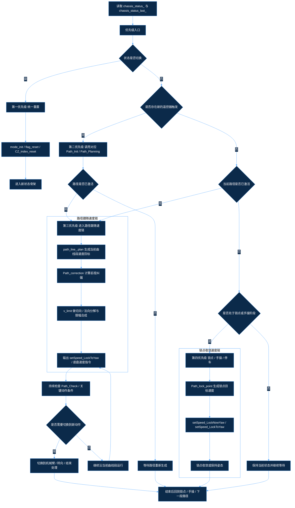
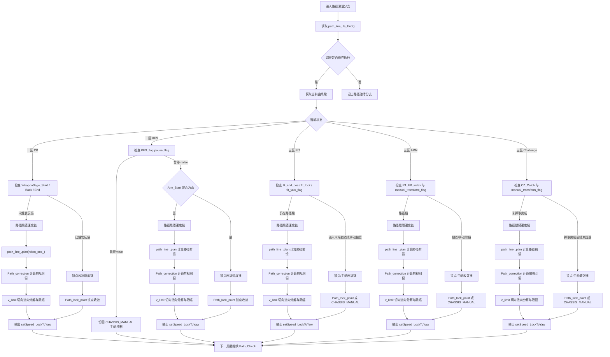
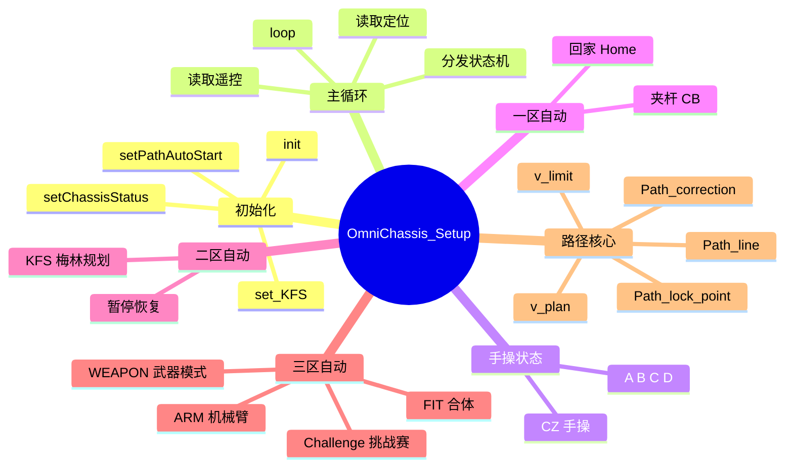

### 通过 `curve = path_line_.get_bezier_curve()` 取出当前正在跟踪的曲线段。

- 第三步
- `()` 负责生成纠偏速度，其数值由前视点与当前位置的误差经 PID 计算得到。
- `v_limit()` 负责将纠偏速度分解为切向和法向分量，并在限幅后与前馈速度合成为最终速度。
- `Pa`
- `s_End()` 的命名与实际语义容易混淆。代码中的返回值更接近“当前路径是否仍在执行”，而不是字面意义上的“是否结束”，因此在状态框架中不能直接按名称解释。
- `CHASSIS_AUTO_CONTROL_CB`、`CHASSIS_AUTO_CONTROL_KFS`、`SEMI_AUIO_CZ_FIT`、`SEMI`行锁点、姿态收口和手动接管判断，因此在统一框架中必须区分“路径结束”和“流程结束”。

### 0.6 统一框架的正确理解方式

- 第一层先看输入：是否存在自动启动、暂停、方向切换、放置或抓取触发。
- 第二层看状态：当前处于手操、一区、二区、三区还是停止，同时确认 `chassis_status_` 是否已经切换。
- 第三层看路径：若路径已经生成并处于激活状态，则继续执行速度规划；若路径尚未生成，则进入对应规划函数。
- 第四层
- 换。

### 0.8 优先级说明

- 最高优先级是状态切换重置，也就是 `chassis_status_` 和 `chassi`
- ：遥控器暂停/恢复边沿，区分了一区回家、二区暂停、以及三区合体等待等流程中的切换行为。
- `airjoy_data_.SWC == 0x00`：遥控器开关处于 0 档，表示一区夹杆主流程，决定路径最终走向 `CB_End_pos`。
- `airjoy_data_.SWC == 0x01`：遥控器开关处于 1 档，表示一区贴边/相机支路，决定路径最终走向 `CB_transition_pos` 和 `CB_welt_pos`。
- `airjoy_data_.SWE == 0`：遥控器开关处于 0 档，三区武器模式进入手动档，底盘按摇杆直接运动。
- `airjoy_data_.SWE == 1`：遥控器开关处于 1 档，三区武器模式进入锁角态，底盘保持目标航向。
- `airjoy_data_.d_pad_up == 1`：遥控器上键触发，表示“放置物块”或“进入合体等待路径”。
- `airjoy_data_.d_pad_down == 1`：遥控器下键触发，表示“退回准备”或“进入等待/抓取路径”。
- `airjoy_data_.d_pad_left == 1` / `airjoy_data_.d_pad_right == 1`：遥控器左右键触发，根据红蓝方阵营决定远近位切换，触发 `R1_RL_index` 或 `R2_pos_index` 的变化。
- `airjoy_data_.right_x`：遥控器右摇杆横向量，用于左右方向连续判定，超过阈值后触发远近位切换或手动转向节奏判断。
- `airjoy_data_.left_x`、`airjoy_data_.left_y`：遥控器左摇杆横纵量，用于纯手操或者路径结束后的微调控制，决定底盘平移分量。

### 1.1 各状态对应的遥控器触发逻辑

- 一区 CB：`flag` 触发开始，`RT` 触发暂停/回家，`SWC` 选择夹杆或贴边/相机支路。
- 二区 KFS：`flag` 触发开始，`RT` 触发暂停或恢复，`KFS1 / KFS2 / KFS3` 决定是否有有效任务，路径执行过程中还会根据机械臂反馈触发锁点或继续规划。
- 三区 FIT：`d_pad_up` 触发进入合体等待，`d_pad_down` 触发等待锁定，左右方向键切换 R2 位点。
- 

